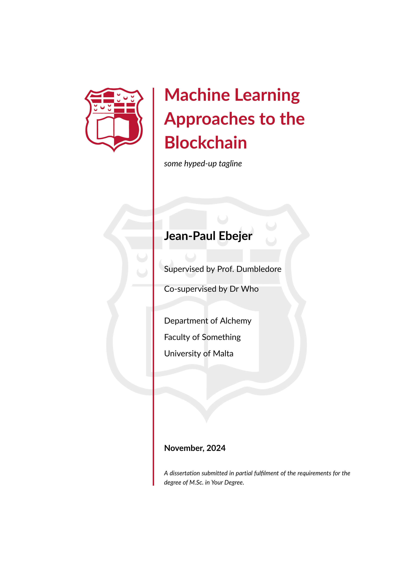
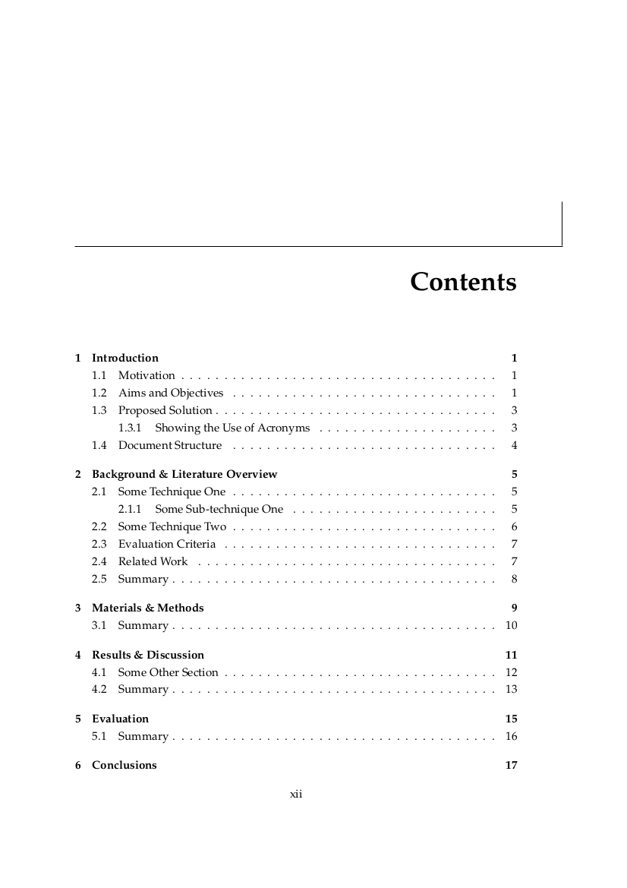
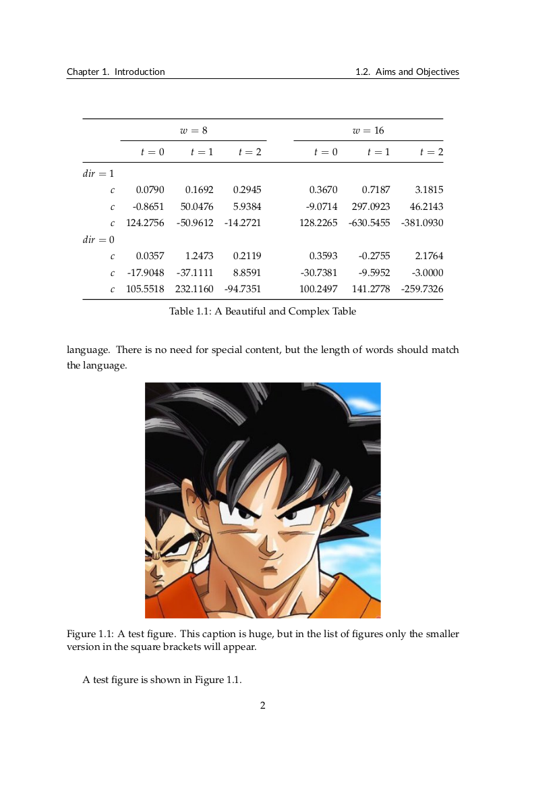
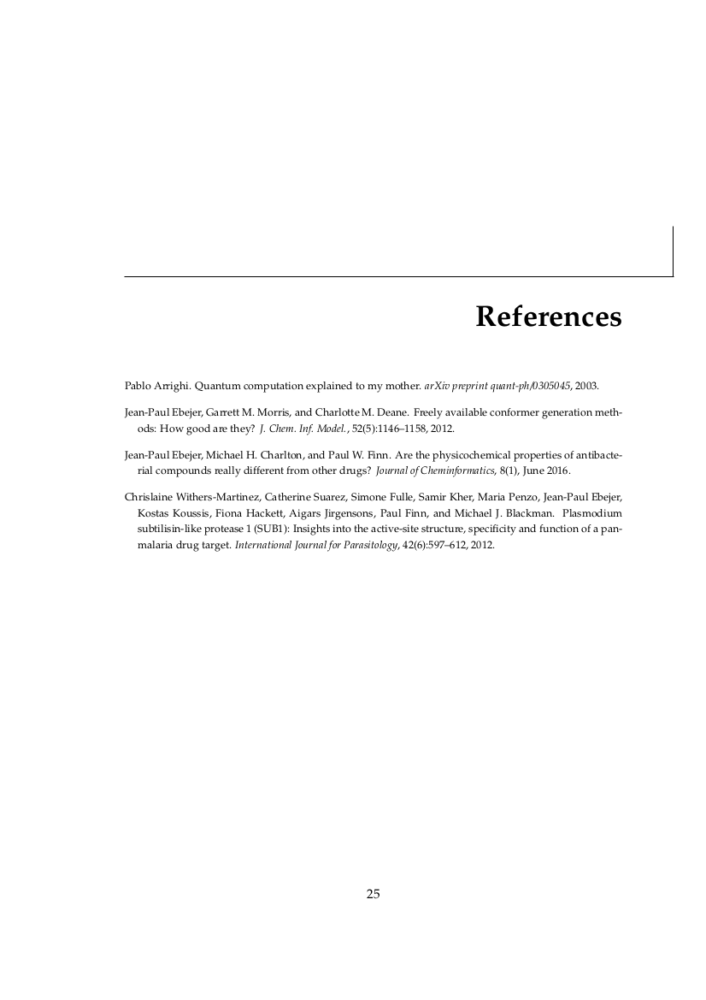
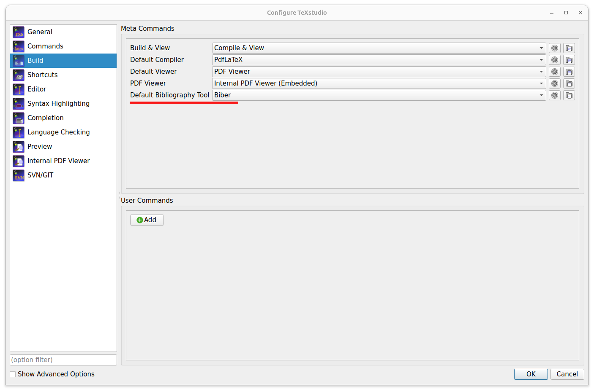
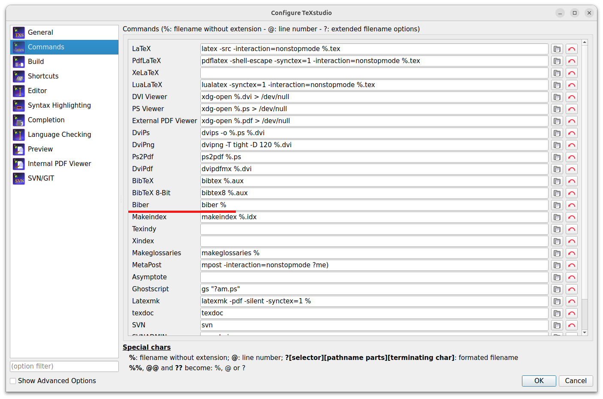

# Preamble

Before embarking on this journey, I suggest you read my [LaTeX](https://bitsilla.com/blog/2019/01/latex-tips-for-your-dissertation-or-project-write-up/) and [content](https://bitsilla.com/blog/2019/03/content-tips-for-your-dissertation-or-project-write-up/) tips.

# University of Malta &ndash; LaTeX Dissertation (or Thesis) Template

Let us not waste any time, you have a project to write up!  [Here](https://github.com/jp-um/university_of_malta_LaTeX_dissertation_template/blob/master/dissertation_main.pdf) is a complete example (PDF format) of what this LaTeX template looks like.  Or quicker...




Now back to the boring bits ...

A modern, highly configurable assignment/project/fyp/dissertation/thesis template for the University of Malta.  (In reality, there is nothing specific to the University of Malta, and this LaTeX class may be used anywhere).  This template is loosely based on my D.Phil. Thesis at the University of Oxford, which was loosely based on ...  You get the drift.

This template was clearly needed, as I keep correcting/examining poorly and inconsistently formatted dissertations all the time.  Updates to the template with examples (2-page landscape table anyone?) are greatly appreciated -- either through pull requests, github issues or emails (jean.p.ebejer@um.edu.mt).

The main file is `dissertation_main.tex`, and this will show you how to organise your dissertation.  Basically replace all `\blindtext` commands with your content and you are there, ready to print.  This is obviously a case of something more easily said than done.

I am also keen on keeping an FAQ with the most common LaTeX problems, which you are bound to face on the night before your submission deadline.

# Requirements

To build this template you will need `latexmk`, `lualatex` (a modern LaTeX engine), `biber` as a `bibtex` replacement, the beautiful Lato font for headings, and also algorithm typesetting from the science packages.  The Lato sans font using in headings creates a pleasing contrast with the serif text. If you require Maltese, you will also need TeX Live 2024 (or later).

# How to build

To build this template into a dissertation you can either use a GUI (like TexStudio) or the command line.  

## Command Line Build

In the directory where `dissertation_main.tex` resides:

```
latexmk -lualatex
```

This generates a lot of clutter, but it is important to go through it as some warnings can give you valuable insight on stuff to fix for a perfect presentation. To clean all the LaTeX generated files:

```
latexmk -c
```

Note that this will leave the generated `pdf` file, as is desirable most of the cases.

## Using TexStudio

To build using TexStudio (F5) you will need to set some options to use biber instead of BibTeX. Under `Options -> Configure TeXstudio` select `Build` and set the `Default Bibliography Tool` to `Biber` from the drop-down list as highlighted in red below.

<p align="center">

</p>

Additionally, under `Options -> Configure TeXstudio` select `Commands` and set the `Biber` text field to `biber %` (highlighted in red below).

<p align="center">

</p>

You should now be able to load the main TEX file (i.e.\ `dissertation_main.tex`) and select `Tools -> Build & View` (or press the F5 shortcut).  Voilà (but do get in touch via the Issues page or email if you cannot sort this out).


# FAQ

The following are a few questions which have been asked about this template (sometime multiple times).


## Why do you make use of LuaLaTeX (instead of pdfLaTeX)?

* You want multilingual documents (Arabic, Chinese, Maltese, etc.).
* You need to use system fonts easily.
* You want future-proof, modern LaTeX with scripting potential.
* You care about high-quality typography.

This template will not work with pdfLaTeX.

## What is the difference (if any) between a thesis and a dissertation?

> University of Malta regulations specify a thesis only in case of PhD, and SThD degrees.  In all other cases it is a dissertation.

Bet you didn't know this one bit of academic trivia!  (Note: The answer is specific to the University of Malta, answer given by our dear registrar, Ms Veronica Grech).


## Which referencing style does this template use?

The template uses the APA referencing style, although it is pretty easy to change to IEEE or Harvard (or anything else for the matter).  The template uses the BibLaTeX package.


## For references, which is better (42) or (Ebejer et al., 2024)?

Many computational scientists are used to the IEEE referencing style with numbers, i.e. `(42)`.  But there is a reason why author year citations, or similar, are superior.  Your examiners (and supervisors) will be well acquainted with the research area and will know which are the main papers you should have read (and cited).  If you use numbered referencing, the examiner has to keep cross-referencing the *References* section.  This is not the case when using the name of the author and year directly in the citation.  Moreover, it is easier for the examiner to realize when you are mis-citing an author.  Modern typesetting is moving in this direction.


## How do I set the document for double-sided printing?

By default the template uses one-sided printing settings as most submissions are electronic nowadays. If you want to change that, simply pass `twoside` as an option to the document class (as opposed to `oneside`) in `dissertation_main.tex`.


## How do I make continuous footnote numbers?

The default in books is for footnote numbers to restart at each chapter (like figures or equations). If you do not want this behaviour, and require continuous numbering for your footnotes add `\counterwithout{footnote}{chapter}` to the preamble in `dissertation_main.tex`.


## May I use this template for my assignment?  What changes do I need?

You must, not should!  You should view any written submission as a training opportunity for your final dissertation.  Getting familiar with the template will help you out later in the course.  Of course, some (very) minor changes to the template are required; as follows:

- From `dissertation_main.tex` comment out (`%`) frontmatter sections for originality, dedication, acknowledgements, and abstract (these would look silly in an assignment).  
- Also, from the same file `dissertation_main.tex` comment out all the appendix material (unless you actually have an appendix; unlikely)

(Let me know if any more changes are required)


## Why are there so many blank pages?

Blank pages are only generated with the `twoside` option.  This is because typesetters don't start new chapters (and abstracts/acknowledgements/etc.) on the *verso* side (left in the western-world) when using both sides of the paper.  Chapters start on the *recto* side (right), so an empty page is inserted if the chapter start falls on the *verso* side (left).  The `oneside` option clearly has no empty pages (or has blank pages at the back of each paper, so every *verso* page is empty).  Note that the page margins are different for the *recto* and *verso* sides in the `twoside` option, this is because of the spline (which is on the right for *verso* and left for *recto*). I hope this is clear, I am an amateur typesetter.


## My supervisor(s) says section X should be named Y.  What should I do?

It is always counter-productive to **not** listen to your supervisor.  This is a generic template, and your specific use-case may have different requirements.  For example, in some departments it is common to have a "Methodology" section instead of the (more experimental) "Materials & Methods".  Elsewhere, the "Evaluation" section is sometimes merged in the "Results and Discussion" chapter.  Some faculties require a standard cover page.  This template is very flexible, and any changes are easy/trivial to make.  The important thing is to use good judgement and that **you follow your supervisor's advice**.


## How do I change the one-and-a-half to double line spacing?

In my opinion you don't want to do this because the document is going to become very long. The idea of having double line spacing is to let examiners/supervisors write between the lines. This is not required for the final submission and mostly superceded by more modern word-processing and reviewing tools. Also, the current one and a half line spacing gives enough space for this.

If you want to go ahead anyway with this, change this line in [um.cls](https://github.com/jp-um/university_of_malta_LaTeX_dissertation_template/blob/aa35454ad53fc4114d7798c8f3b442f59bc9cabb/um.cls#L123) from `\OnehalfSpacing` to `\DoubleSpacing`.

## How do I change the document margins?

Also required in ancient times to write notes in the margin (and again superceded by modern word-processing and reviewing tools).

Still, should be an easy one, just change the values in the following line in [um.cls](https://github.com/jp-um/university_of_malta_LaTeX_dissertation_template/blob/aa35454ad53fc4114d7798c8f3b442f59bc9cabb/um.cls#L148).

## How do I write good Latex Mathematical Notation/Formulae?

The [Math on Quora](https://math-on-quora.surge.sh/) is all you need. Any math notation you might need is available conveniently in the menu bar. All examples contain live code blocks so you can try out your math formulae directly in the web browser.

## How do subgroup my chapters in parts?

Some of the longer documents, such as doctoral dissertations, require a sub-grouping of chapters together. This may be easily achieved with `\part{My First Part}` in the the main document file (e.g. `dissertation_main.tex`) right before the chapters which make up the part (see [example](https://github.com/jp-um/university_of_malta_LaTeX_dissertation_template/blob/main/dissertation_main.tex)).


## I have a huge figure which takes up all the page.  I would like to switch off headers and the bottom page numbers, but `\thispagestyle{empty}` does nothing (or changes some other page).

The template uses the `floatpag` package.  All you need to do is place a `\thisfloatpagestyle{empty}` inside the figure or table environment.  Et voilà!  There is an example of this [here](https://github.com/jp-um/university_of_malta_LaTeX_dissertation_template/blob/aa35454ad53fc4114d7798c8f3b442f59bc9cabb/chap3/materials_and_methods_main.tex#L415).

